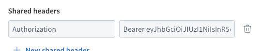
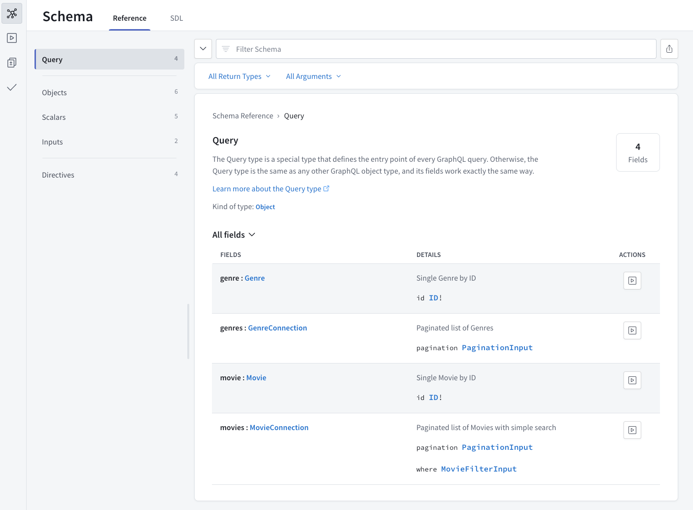

# Movies API (GraphQL and REST)

## Overview

Welcome to the [Project Name] repository! This open-source project provides a comprehensive API (both GraphQL and RESTful) for accessing a wide range of movie data. Whether you're looking for a specific title or exploring different genres, our API makes it easy to access the information you need.

## Features

- **GraphQL & RESTful API**: Two ways to interact with our movie database.
- **Bearer Token Authorization**: Secure access to our API endpoints.
- **Extensive Movie Data**: Access a wide range of movie information.

## Getting Started

### Obtaining an Access Token

To use our API, first, obtain a bearer token:

1. Send a `GET` request to `<final URL here>/auth/token`.
2. Use this token in the Authorization header of your subsequent API calls.

### Setting Up the GraphQL Sandbox

1. Open the GraphQL sandbox endpoint and click on the connection settings

   [ add image here ]

2. Update the headers by adding the `Authorization` bearer token

## API Endpoints

Here's a list of our available API endpoints:

### RESTful Endpoints

- `GET /auth/token`: Fetch a valid token to be used in the queries below
- `GET /healthcheck`: Check status of the app
- `GET /genres/movies`: Fetch a list of all movie IDs grouped by genre
  - Query Parameters:
    - `page`: the page number to be fetched, starting at page 1 (default = 1)
    - `limit`: the number of items per page (default = 25)
- `GET /movies`: Fetch a list of all movies
  - Query Parameters:
    - `page`: the page number to be fetched, starting at page 1 (default = 1)
    - `limit`: the number of items per page (default = 25)
    - `search`: searches for a movie title (simple string match in the whole title string)
    - `genre`: searches for a movie genre (exact match)
- `GET /movies/{id}`: Fetch details of a specific movie
- `GET /movies/titles`: Fetch a list of all movie IDs and titles
  - Query Parameters:
    - `page`: the page number to be fetched, starting at page 1 (default = 1)
    - `limit`: the number of items per page (default = 25)
- `GET /movies/genres/{id}`: Fetch stats details of a movie genre

### GraphQL Queries

GraphQL queries can be accessed using the endpoint `/graphql`. Open the sandbox at `<add final URL here>` and take a look at the query schema documentation.

## License

This project is licensed under the MIT license.
